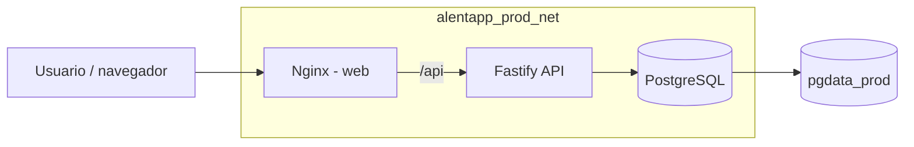

# Actividad 4 - Fase 2: Especificar y diseñar

**Proyecto:** AlentApp  
**Seccion:** 2.1. Diseño de la infraestructura Docker  
**Fecha:** 03/06/2026

---

## 2.1. Diseño de la infraestructura Docker

La infraestructura productiva propuesta separa el entorno de desarrollo del entorno de ejecucion real. El `docker-compose.yml` actual es adecuado para desarrollo porque monta el codigo fuente como volumen, usa hot reload (`tsx watch` y `vite dev`) y expone directamente los puertos de API, frontend y base de datos. Para produccion se propone crear archivos nuevos, sin reemplazar el flujo de desarrollo:

- `packages/api/Dockerfile.prod`
- `packages/web/Dockerfile.prod`
- `docker-compose.prod.yml`

El objetivo principal es construir imagenes mas pequeñas, reproducibles y seguras, ejecutar procesos sin privilegios, eliminar herramientas de build del runtime, aislar servicios en una red interna y mover configuracion sensible a variables de entorno. Esta decision sigue el criterio de multi-stage builds de Docker, donde solo se copian a la imagen final los artefactos necesarios para ejecutar la aplicacion, dejando fuera dependencias y herramientas de compilacion. Tambien se alinea con 12-Factor App: configuracion por entorno, separacion entre build/release/run, procesos descartables y logs tratados como flujos de eventos.

### Arquitectura propuesta



La unica entrada publica sera el servicio `web` por HTTP/HTTPS. Nginx servira los archivos estaticos del frontend y actuara como reverse proxy para las rutas `/api`, reenviandolas al servicio `api` dentro de la red Docker. La base de datos no debera publicar puertos al host en produccion; solo sera accesible desde la API mediante el nombre interno `db`.

---

## a) `packages/api/Dockerfile.prod`

### Proposito

Este archivo define la imagen productiva de la API Node.js/Fastify. Es necesario porque el `packages/api/Dockerfile` actual instala dependencias de desarrollo y ejecuta TypeScript con `tsx watch`, comportamiento correcto para desarrollo pero no para produccion.

La imagen productiva debe:

- Compilar TypeScript a JavaScript antes de ejecutar.
- Instalar en runtime solo dependencias de produccion.
- Incluir el cliente Prisma generado y los artefactos necesarios para migraciones.
- Ejecutar con usuario no-root.
- Exponer un healthcheck HTTP contra `127.0.0.1:3000`.

### Estructura

| Etapa | Base | Proposito | Contenido esperado |
| --- | --- | --- | --- |
| `deps` | `node:22-alpine` | Instalar dependencias de produccion con `npm ci --omit=dev`. | `package-lock.json`, `package.json`, package manifests de workspaces y `node_modules` productivos. |
| `build` | `node:22-alpine` | Instalar dependencias completas, generar Prisma y compilar TypeScript. | Codigo fuente, `node_modules` de build, `dist/`, cliente Prisma generado. |
| `runtime` | `node:22-alpine` | Ejecutar solo la aplicacion compilada. | `dist/`, `node_modules` productivos, `package.json`, schema/migraciones Prisma y usuario sin privilegios. |

### Capas y orden recomendado

1. Copiar primero los manifiestos (`package*.json`, `packages/api/package.json`, `packages/shared/package.json`) para maximizar cache de dependencias.
2. Ejecutar `npm ci` en lugar de `npm install` para builds reproducibles basados en `package-lock.json`.
3. Copiar el codigo fuente recien despues de instalar dependencias.
4. Ejecutar `npx prisma generate --config packages/api/prisma.config.ts`.
5. Compilar la API a `dist/`.
6. En la etapa `runtime`, copiar solo lo necesario desde `deps` y `build`.
7. Crear o usar un usuario no-root (`node` o `appuser`) y definir `USER`.
8. Definir `HEALTHCHECK` contra un endpoint HTTP de la API.

### Requisitos no funcionales

| Requisito | Criterio de aceptacion |
| --- | --- |
| Tamaño de imagen | Reducir al menos 70% respecto de la imagen de desarrollo. Meta estimada: menor a 300 MB. |
| Seguridad | Ejecutar como usuario no-root, sin credenciales hardcodeadas y sin herramientas de desarrollo en runtime. |
| Startup | Tiempo de arranque menor a 20 segundos una vez que PostgreSQL este saludable. |
| Confiabilidad | Healthcheck HTTP cada 30 segundos con timeout de 5 segundos y reintentos configurados. |
| Configuracion | `DATABASE_URL`, `NODE_ENV`, `PORT` y secretos deben venir desde variables de entorno o `.env`, no desde el Dockerfile. |
| Mantenibilidad | El Dockerfile debe conservar etapas nombradas (`deps`, `build`, `runtime`) para facilitar debugging con `--target`. |

### Diseño conceptual

```dockerfile
FROM node:22-alpine AS deps
WORKDIR /app
COPY package*.json ./
COPY packages/api/package.json packages/api/
COPY packages/shared/package.json packages/shared/
RUN npm ci --omit=dev

FROM node:22-alpine AS build
WORKDIR /app
COPY package*.json ./
COPY packages/api/package.json packages/api/
COPY packages/shared/package.json packages/shared/
RUN npm ci
COPY . .
RUN npx prisma generate --config packages/api/prisma.config.ts
RUN npm run build -w packages/api

FROM node:22-alpine AS runtime
WORKDIR /app
ENV NODE_ENV=production
COPY --from=deps /app/node_modules ./node_modules
COPY --from=build /app/packages/api/dist ./packages/api/dist
COPY --from=build /app/packages/api/prisma ./packages/api/prisma
COPY package*.json ./
COPY packages/api/package.json packages/api/
COPY packages/shared/package.json packages/shared/
USER node
EXPOSE 3000
HEALTHCHECK --interval=30s --timeout=5s --retries=3 CMD wget -qO- http://127.0.0.1:3000/health || exit 1
CMD ["node", "packages/api/dist/app.js"]
```

> Nota: si la API todavia no tiene script `build` o endpoint `/health`, deben agregarse en la Fase 3 para cumplir este diseño.

---

## b) `packages/web/Dockerfile.prod`

### Proposito

Este archivo define la imagen productiva del frontend React/Vite. Es necesario porque el `packages/web/Dockerfile` actual ejecuta `npm run dev` y deja Node.js sirviendo el frontend. En produccion, Vite debe generar archivos estaticos y Nginx debe servirlos de forma eficiente.

La imagen productiva debe:

- Compilar el frontend con `vite build`.
- Servir `dist/` con `nginx:stable-alpine`.
- Incluir configuracion de SPA fallback para React Router.
- Activar gzip, cache para assets versionados y security headers.
- Exponer healthcheck contra `127.0.0.1:80`.

### Estructura

| Etapa | Base | Proposito | Contenido esperado |
| --- | --- | --- | --- |
| `deps` | `node:22-alpine` | Instalar dependencias necesarias para construir el frontend. | Manifiestos del monorepo y `node_modules`. |
| `build` | `node:22-alpine` | Ejecutar `npm run build -w packages/web`. | Codigo fuente y salida `packages/web/dist`. |
| `runtime` | `nginx:stable-alpine` | Servir archivos estaticos y proxyear API. | `dist/` copiado a `/usr/share/nginx/html` y configuracion Nginx. |

### Configuracion Nginx esperada

Nginx tendra dos responsabilidades:

1. Servir la SPA:
   - `try_files $uri $uri/ /index.html;`
   - cache agresivo para `/assets/*`.
   - sin cache para `index.html`, para que el navegador tome nuevas versiones del bundle.

2. Actuar como reverse proxy:
   - `location /api/ { proxy_pass http://api:3000/api/; }`
   - preservar headers como `Host`, `X-Real-IP` y `X-Forwarded-For`.
   - configurar timeouts razonables.

Headers recomendados:

- `X-Content-Type-Options: nosniff`
- `X-Frame-Options: DENY`
- `Referrer-Policy: strict-origin-when-cross-origin`
- `Content-Security-Policy` inicial conservadora y ajustable segun assets externos reales.

### Requisitos no funcionales

| Requisito | Criterio de aceptacion |
| --- | --- |
| Tamaño de imagen | Meta menor a 170 MB. La imagen final no debe incluir Node.js ni dependencias de desarrollo. |
| Performance | Assets estaticos con gzip y cache de largo plazo para archivos versionados. |
| Startup | Nginx debe iniciar en menos de 5 segundos. |
| Seguridad | Runtime basado en Nginx, filesystem preferentemente read-only desde Compose y capabilities reducidas. |
| Disponibilidad | Healthcheck HTTP contra `http://127.0.0.1/`. |
| Ruteo | Todas las rutas de React Router deben resolver con fallback a `index.html`. |

### Diseño conceptual

```dockerfile
FROM node:22-alpine AS deps
WORKDIR /app
COPY package*.json ./
COPY packages/web/package.json packages/web/
COPY packages/shared/package.json packages/shared/
RUN npm ci

FROM node:22-alpine AS build
WORKDIR /app
COPY --from=deps /app/node_modules ./node_modules
COPY . .
RUN npm run build -w packages/web

FROM nginx:stable-alpine AS runtime
COPY packages/web/nginx.conf /etc/nginx/conf.d/default.conf
COPY --from=build /app/packages/web/dist /usr/share/nginx/html
EXPOSE 80
HEALTHCHECK --interval=30s --timeout=5s --retries=3 CMD wget -qO- http://127.0.0.1/ || exit 1
CMD ["nginx", "-g", "daemon off;"]
```

---

## c) `docker-compose.prod.yml`

### Proposito

Este archivo define como ejecutar AlentApp en un entorno productivo de un solo host. Es necesario porque el Compose actual esta orientado a desarrollo: monta el repositorio completo, publica PostgreSQL al host y usa servidores con hot reload. La version productiva debe ejecutar imagenes ya compiladas, sin bind mounts de codigo fuente, con seguridad reforzada, healthchecks y limites de recursos.

### Servicios

| Servicio | Imagen/build | Responsabilidad | Exposicion |
| --- | --- | --- | --- |
| `web` | `packages/web/Dockerfile.prod` | Servir frontend y proxyear `/api` a la API. | Publica `8080:80` para validacion local; en servidor productivo puede mapearse `80:80` y opcionalmente `443:443`. |
| `api` | `packages/api/Dockerfile.prod` | Ejecutar Fastify, Prisma y reglas de negocio. | No publica puerto al host; solo red interna. |
| `db` | `postgres:16-alpine` | Persistencia relacional de AlentApp. | Sin puerto publico; volumen `pgdata_prod`. |

### Secciones requeridas

#### Red interna

Crear una red explicita `alentapp_prod_net` para evitar depender de la red `bridge` default. Los servicios se comunican por nombre DNS interno (`api`, `db`).

#### Volumen persistente

Usar `pgdata_prod:/var/lib/postgresql/data` para conservar datos de PostgreSQL entre recreaciones de contenedores.

#### Variables y secretos

Las variables sensibles deben venir desde `.env`:

```env
POSTGRES_USER=alentapp
POSTGRES_PASSWORD=...
POSTGRES_DB=alentapp_db
DATABASE_URL=postgres://alentapp:...@db:5432/alentapp_db
```

El archivo `.env` no debe versionarse. En un entorno mas avanzado, las contraseñas deberian migrarse a Docker secrets o al gestor de secretos de la plataforma.

#### Seguridad

Aplicar por servicio, segun compatibilidad:

- `read_only: true` en `api` y `web`.
- `tmpfs` para rutas temporales necesarias (`/tmp`, `/var/cache/nginx`, `/var/run`).
- `cap_drop: ["ALL"]`.
- `cap_add: ["NET_BIND_SERVICE", "CHOWN", "SETGID", "SETUID"]` en `web`: Nginx necesita bindear puerto 80 y bajar privilegios a sus workers internos. La API no requiere capabilities extra.
- `security_opt: ["no-new-privileges:true"]`.
- `restart: unless-stopped`.

#### Healthchecks

- `db`: `pg_isready`.
- `api`: HTTP contra `/health`.
- `web`: HTTP contra `/`.

#### Logging

Usar `json-file` con rotacion:

```yaml
logging:
  driver: json-file
  options:
    max-size: "10m"
    max-file: "3"
```

#### Limites de recursos

Valores iniciales propuestos para un entorno de baja/mediana carga:

| Servicio | CPU | Memoria |
| --- | --- | --- |
| `web` | `0.25` | `128M` |
| `api` | `0.75` | `512M` |
| `db` | `1.00` | `1G` |

Estos limites deben ajustarse con metricas reales durante la Fase 4.

### Diseño conceptual

```yaml
services:
  db:
    image: postgres:16-alpine
    env_file: .env
    environment:
      POSTGRES_USER: ${POSTGRES_USER}
      POSTGRES_PASSWORD: ${POSTGRES_PASSWORD}
      POSTGRES_DB: ${POSTGRES_DB}
    volumes:
      - pgdata_prod:/var/lib/postgresql/data
    networks:
      - alentapp_prod_net
    healthcheck:
      test: ["CMD-SHELL", "pg_isready -U ${POSTGRES_USER} -d ${POSTGRES_DB}"]
      interval: 10s
      timeout: 5s
      retries: 5
    restart: unless-stopped
    security_opt:
      - no-new-privileges:true
    logging:
      driver: json-file
      options:
        max-size: "10m"
        max-file: "3"
    deploy:
      resources:
        limits:
          cpus: "1.00"
          memory: 1G

  api:
    build:
      context: .
      dockerfile: packages/api/Dockerfile.prod
    env_file: .env
    environment:
      NODE_ENV: production
      PORT: 3000
    depends_on:
      db:
        condition: service_healthy
    networks:
      - alentapp_prod_net
    read_only: true
    tmpfs:
      - /tmp
    cap_drop:
      - ALL
    security_opt:
      - no-new-privileges:true
    healthcheck:
      test: ["CMD-SHELL", "wget -qO- http://127.0.0.1:3000/health || exit 1"]
      interval: 30s
      timeout: 5s
      retries: 3
    restart: unless-stopped
    logging:
      driver: json-file
      options:
        max-size: "10m"
        max-file: "3"
    deploy:
      resources:
        limits:
          cpus: "0.75"
          memory: 512M

  web:
    build:
      context: .
      dockerfile: packages/web/Dockerfile.prod
    ports:
      - "8080:80"
    depends_on:
      api:
        condition: service_healthy
    networks:
      - alentapp_prod_net
    read_only: true
    tmpfs:
      - /var/cache/nginx
      - /var/run
      - /tmp
    cap_drop:
      - ALL
    cap_add:
      - CHOWN
      - NET_BIND_SERVICE
      - SETGID
      - SETUID
    security_opt:
      - no-new-privileges:true
    healthcheck:
      test: ["CMD-SHELL", "wget -qO- http://127.0.0.1/ || exit 1"]
      interval: 30s
      timeout: 5s
      retries: 3
    restart: unless-stopped
    logging:
      driver: json-file
      options:
        max-size: "10m"
        max-file: "3"
    deploy:
      resources:
        limits:
          cpus: "0.25"
          memory: 128M

volumes:
  pgdata_prod:

networks:
  alentapp_prod_net:
    driver: bridge
```

---

## `.dockerignore` requerido

El `.dockerignore` actual ya excluye `node_modules`, `dist`, `.git` y logs. Para produccion conviene ampliarlo para reducir el contexto de build y evitar copiar archivos innecesarios o sensibles:

```dockerignore
node_modules
**/node_modules
dist
**/dist
.git
.env
.env.*
*.log
coverage
test-results
playwright-report-fullstack
uploads
docs
```

Si algun archivo de `docs` o `uploads` fuera necesario en runtime, debe copiarse de forma explicita y justificada.

---

## Criterios de verificacion para la Fase 3

Las migraciones de Prisma se tratan como un paso de release separado, no como responsabilidad permanente del contenedor runtime. Para mantener la imagen `alentapp-api:prod` sin CLI de Prisma ni herramientas de build, se puede etiquetar la etapa `build` y ejecutar migraciones dentro de la red interna:

```bash
docker build --target build -f packages/api/Dockerfile.prod -t alentapp-api:migrate .
docker run --rm --network alentapp_alentapp_prod_net --env-file .env.prod -w /app/packages/api alentapp-api:migrate npx prisma migrate deploy --config prisma.config.ts
```

| Verificacion | Comando esperado | Resultado aceptado |
| --- | --- | --- |
| Build API | `docker build -f packages/api/Dockerfile.prod -t alentapp-api:prod .` | Build exitoso. |
| Build Web | `docker build -f packages/web/Dockerfile.prod -t alentapp-web:prod .` | Build exitoso. |
| Tamaño | `docker image ls alentapp-api alentapp-web` | API menor a 300 MB y web menor a 170 MB. |
| Sin herramientas de build | `docker run --rm alentapp-api:prod which tsc` | Debe fallar o no encontrar `tsc`. |
| Compose prod | `docker compose -f docker-compose.prod.yml up -d --build` | Servicios healthy. |
| API via proxy | `curl http://localhost:8080/api/v1/socios` | Respuesta desde Nginx hacia API. |
| Filesystem read-only | `docker exec alentapp-api touch /test` | Debe fallar. |
| DB no publica puerto | `docker compose -f docker-compose.prod.yml ps` | `db` sin mapping `5432:5432`. |

---

## Referencias

- Docker Docs. Multi-stage builds: https://docs.docker.com/build/building/multi-stage/
- Docker Docs. Building best practices: https://docs.docker.com/build/building/best-practices/
- Docker Docs. Docker Engine security: https://docs.docker.com/engine/security/
- Docker Docs. Use Compose in production: https://docs.docker.com/compose/how-tos/production/
- The Twelve-Factor App: https://12factor.net/
- NGINX Docs. Reverse Proxy: https://docs.nginx.com/nginx/admin-guide/web-server/reverse-proxy/
