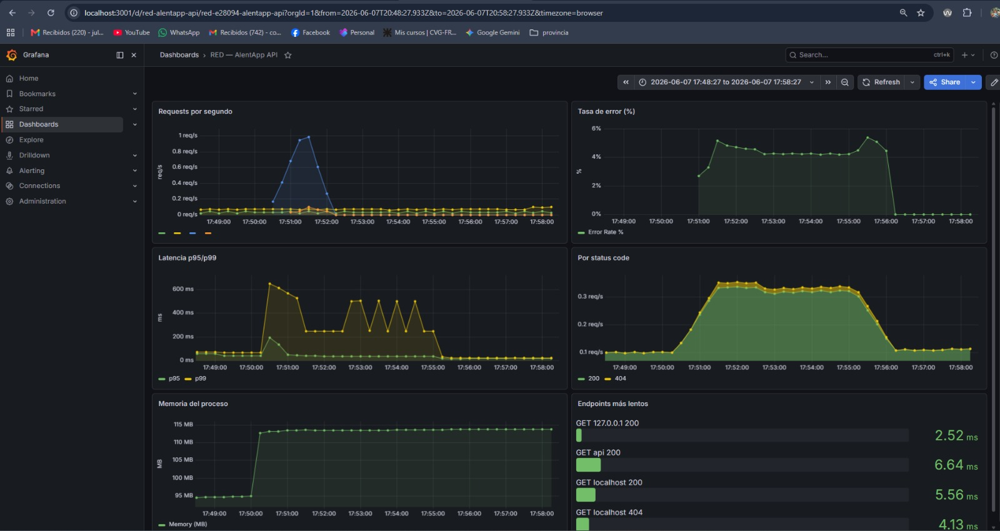

# Fase 4: Verificar y entregar

**Proyecto:** AlentApp
**Entorno verificado:** `docker-compose.prod.yml` (single-host)
**Fecha:** 06/06/2026

> Todos los valores de este informe se obtuvieron levantando el stack productivo desde cero
> (`docker compose -f docker-compose.prod.yml down -v && up -d --build`) y ejecutando las
> verificaciones contra los contenedores reales.

---

## 4.1. Verificación técnica

| Métrica | Antes (desarrollo) | Después (producción) | Mejora |
| --- | --- | --- | --- |
| Tamaño imagen API | 1.65 GB | **393 MB** | **−76 %** |
| Tamaño imagen Web | 858 MB | **64.3 MB** | **−92 %** |
| Tiempo de startup (stack completo hasta `healthy`) | N/D¹ | **22 s** | — |
| Memoria API (idle) | N/D¹ | **60 MiB** / 512 MiB | — |
| Endpoints accesibles (vía proxy) | — | `GET /api/v1/socios` → **200**, `GET /api/v1/lockers` → **200** | — |
| Frontend vía nginx | — | `GET http://localhost:8080/` → **200** | — |

¹ En desarrollo la API y el frontend corren con hot-reload (`tsx watch` / `vite dev`) y bind-mounts, por lo que el startup y la memoria no son comparables de forma directa con producción.

**Reducción de tamaño:** la imagen de la API pasó de 1.65 GB a 393 MB (**−76 %**) y la del frontend de 858 MB a 64.3 MB (**−92 %**), cumpliendo el objetivo de reducir **≥ 70 %** mediante multi-stage builds.

Comandos de verificación:
```bash
docker image ls alentapp-api alentapp-web                 # tamaños
docker compose -f docker-compose.prod.yml ps              # estado healthy
docker stats --no-stream alentapp-api                     # memoria idle
curl -w "%{http_code}" http://localhost:8080/api/v1/socios   # endpoint vía nginx
```

---

## 4.2. Verificación de seguridad

| Medida | Resultado | Evidencia |
| --- | --- | --- |
| La API corre con usuario **no-root** | ✅ | `docker exec alentapp-api whoami` → `node` |
| **No hay `tsc` ni `python`** en la imagen final | ✅ | `which tsc` / `which python` → no encontrados |
| **Read-only filesystem** activo | ✅ | `touch /probe` → `Read-only file system`; `ReadonlyRootfs=true` |
| **Capabilities mínimas** | ✅ | API: `CapDrop=[ALL]`, `CapAdd=[]`. Web: `CapDrop=[ALL]`, `CapAdd=[NET_BIND_SERVICE,CHOWN,SETGID,SETUID]` |
| Variables sensibles vía **`.env`**, no hardcodeadas | ✅ | 0 credenciales en `docker-compose.prod.yml`; `.env` ignorado por git y excluido del contexto de build (`.dockerignore`) |
| **Healthchecks** funcionando | ✅ | `docker compose ps` → `db`, `api`, `web` en estado `healthy` |
| **DB sin puerto expuesto** al host | ✅ | `db` solo accesible por la red interna `alentapp_prod_net` |

> **Nota honesta:** `npm` sí está presente en la imagen final porque viene incluido en la base oficial `node:22-alpine`. Eliminarlo requeriría una base *distroless*; se documenta como mejora futura. Las herramientas de build propias del proyecto (`tsc`, `vite`, `prisma` CLI, `tsx`) **no** están en el runtime.

---

## 4.3. Verificación de observabilidad

| Verificación | Resultado | Evidencia |
| --- | --- | --- |
| OpenTelemetry exporta métricas en `:9464/metrics` | ✅ | Expone `http_server_duration_*` (instrumentación HTTP + Fastify) |
| Prometheus scrapea el endpoint OTel | ✅ | Target `opentelemetry` (`api:9464`) en estado `health: up` |
| Prometheus almacena las métricas | ✅ | `sum(http_server_duration_count)` = 128 tras generar tráfico |
| Grafana con datasource Prometheus | ✅ | Datasource `Prometheus` (`http://prometheus:9090`), provisionado como default |
| Dashboard **RED** con 6 paneles | ✅ | Dashboard *"RED — AlentApp API"*: Requests/s, Tasa de error %, Latencia p95/p99, Por status code, Memoria del proceso, Endpoints más lentos |
| Los gráficos responden al tráfico | ✅ | 80 requests OK reflejados en los paneles |
| Las métricas de error reflejan 4xx/5xx | ✅ | `sum(http_server_duration_count{http_status_code=~"[45].."})` = 10 (status `404`) |

**Pipeline:** `API (OTel SDK) → PrometheusExporter :9464 → Prometheus → Grafana`.
Acceso a Grafana: `http://localhost:3001` (admin / admin).

---

## 4.4. Documentación de decisiones

### Arquitectura final

```
            Host                         Red interna: alentapp_prod_net
  ┌───────────────────┐
  │ navegador :8080 ──────►  web (nginx)  ──/api──►  api (Fastify)  ──►  db (PostgreSQL)
  └───────────────────┘     · sirve SPA        · read-only            · sin puerto al host
  ┌───────────────────┐     · gzip+cache       · no-root             · volumen pgdata_prod
  │ Grafana  :3001  ◄──────  grafana  ◄──────  prometheus  ◄──:9464── (OTel /metrics)
  └───────────────────┘
```

- **Única entrada pública:** `web` (nginx) en `:8080`. La API y la DB solo viven en la red interna.
- **nginx** sirve los estáticos del build de Vite y actúa como reverse-proxy de `/api` hacia `api:3000`.
- **Observabilidad** desacoplada: la API expone métricas en `:9464`, Prometheus las scrapea y Grafana las grafica.

### Decisiones técnicas

| Decisión | Justificación |
| --- | --- |
| **Multi-stage build** (`deps` / `build` / `runtime`) | Deja fuera del runtime las devDependencies y herramientas de compilación → imágenes −76 %/−92 %. |
| **nginx** para el frontend (no Node en prod) | Servir estáticos es más liviano y seguro; permite gzip, cache de assets y security headers. |
| **OpenTelemetry + PrometheusExporter** (pull) | Se usó el exporter Prometheus en lugar de OTLP + Collector para simplificar el stack en esta etapa, manteniendo la instrumentación vendor-neutral. |
| **Seguridad por capas** | `read_only`, `cap_drop: ALL`, `no-new-privileges`, usuario no-root y secretos en `.env`: defensa en profundidad. |
| **Migraciones como paso de release separado** | `prisma migrate deploy` se ejecuta desde la etapa `build` (que sí tiene el CLI), manteniendo la imagen de runtime sin Prisma CLI ni herramientas de build. |
| **Volumen `uploads_prod`** | La API escribe archivos subidos en `/app/uploads`; con `read_only: true` el volumen es la única ruta de escritura, sin romper el resto del filesystem. |

### Problemas encontrados y solución

1. **`package-lock.json` desincronizado** con las dependencias de OpenTelemetry → `npm ci` fallaba en el build. **Solución:** `npm install` para reconciliar el lockfile.
2. **Errores de tipo en `telemetry.ts`** que solo aparecían en el build de producción (`tsc`), no en desarrollo (`tsx` no hace type-check estricto). **Solución:** corregir imports y configuración de instrumentaciones.
3. **`read_only` rompía el arranque de la API** (`fs.mkdirSync('uploads')`). **Solución:** montar el volumen `uploads_prod`.
4. **Build del frontend fallaba** por variables TS sin usar (afloran solo con `tsc -b` en prod). **Solución:** limpieza del código por el equipo de frontend.
5. **Conflictos de red por URLs absolutas en el frontend** (`host not found in upstream "api"`), debido a que la API estaba *hardcodeada* y no resolvía correctamente en la red de Docker. **Solución:** Implementar lógica dinámica para `API_URL` usando `import.meta.env` en `api/src/config.ts` e importandolo en `/services`. En desarrollo exige un archivo `.env`, y en producción hace *fallback* a un *string* vacío para utilizar el *reverse proxy* de Nginx `localhost:8080/api/v1/...`

### Migraciones (procedimiento de release)

```bash
docker build --target build -f packages/api/Dockerfile.prod -t alentapp-api:migrate .
docker run --rm --network alentapp_alentapp_prod_net --env-file .env \
  -w /app/packages/api alentapp-api:migrate \
  npx prisma migrate deploy --config prisma.config.ts
```

### Capturas de pantalla

> _Captura del dashboard "RED — AlentApp API" con los 6 paneles mostrando datos tras generar tráfico (Grafana en `http://localhost:3001`)._




---

## Resumen de verificación

| Área | Estado |
| --- | --- |
| Build multi-stage + reducción ≥ 70 % | ✅ (−76 % API, −92 % Web) |
| Seguridad (no-root, read-only, caps, secrets, healthchecks) | ✅ |
| Observabilidad (OTel + Prometheus + Grafana + dashboard RED 6 paneles) | ✅ |
| Funcionalidad end-to-end (navegador → nginx → API → DB) | ✅ |

**El entorno productivo levanta de cero, queda `healthy` y es funcional y observable.**
